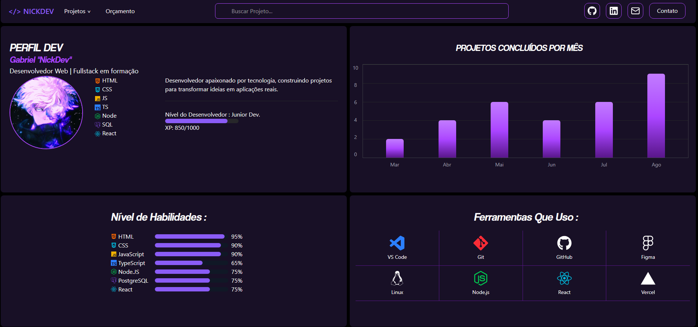

# NICKDEV — Portfólio

Uma breve descrição do projeto.

## Tecnologias

- React
- Vite
- Tailwind CSS
- JavaScript
- React Icons

## Funcionalidades

- Perfil do desenvolvedor
- Gráfico de projetos concluídos por mês
- Barras de habilidades
- Ferramentas utilizadas
- Menu de projetos
- Campo de busca
- Links para redes sociais
- Layout responsivo

## Preview



## Como executar

Clone o repositório:

```bash
git clone https://github.com/SEU-USUARIO/SEU-REPOSITORIO.git
```
